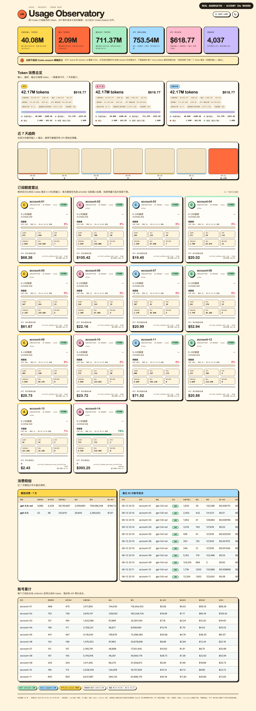

# cliproxyapi-usage-meter

[](https://github.com/LuckyJoeshp/cliproxyapi-usage-meter)
[](https://www.python.org/)
[](tests/)
[](LICENSE)

**A local, token-safe Usage Observatory for CLIProxyAPI.**

See every request, split input/cache/output tokens, estimate API-equivalent
cost, observe quota resets, and understand account-pool retries from one
private-by-default dashboard. It runs as a transparent sidecar: clients can
send traffic through `8327`, while the optional read-only queue collector also
captures clients that still use `8317`.



_The screenshot is a real dashboard render: token totals, cost estimates,
quota percentages, trends, model usage, and every account card remain visible.
Only account names/identifiers and the account column in recent tables are
replaced with neutral demo labels._

> This is an observability tool, not a billing API. It cannot read an official
> ChatGPT subscription balance. Dollar figures are API-price equivalents, and
> quota figures are observed/provider-reported windows—not invoices or
> guaranteed remaining balances.

```text
client -> 127.0.0.1:8327/v1/... -> usage meter -> 127.0.0.1:8317/v1/...
```

## Why use it

CLIProxyAPI can fan one logical request across several subscription accounts.
That makes a raw proxy log difficult to answer: **what did I actually consume,
which account handled it, how much was cached, and why did the account pool
retry?** This sidecar keeps those questions separate and auditable in SQLite.

## What it gives you

| Capability | What is tracked |
| --- | --- |
| Token accounting | Non-cached input, cached input, output, reasoning subset, and raw API processing |
| Cost estimation | Collector-frozen per-request prices or official OpenAI short/long-context prices, split by token type |
| Account behavior | Per-subscription calls, success/failure, models, dates, and token totals |
| Quota visibility | Read-only 5-hour/week/month snapshots, reset times, cooldowns, and observed floors |
| Collection paths | Transparent `8327` proxy, optional destructive-read `8317` usage queue, and default-on read-only Cockpit Tools import |
| Dashboard | Inline, dependency-free `/usage` HTML with trend, account, model, and recent-call views |
| Privacy boundary | Loopback by default; credentials and request metadata discarded; email is memory-only |

## Quick start

```bash
git clone https://github.com/LuckyJoeshp/cliproxyapi-usage-meter.git
cd cliproxyapi-usage-meter

# Keep CLIProxyAPI on 8317; point only the clients you want observed at 8327.
PORT=8327 UPSTREAM=http://127.0.0.1:8317 \
  scripts/start_cliproxy_usage_meter.sh
```

Open <http://127.0.0.1:8327/usage>.

The launcher applies an owner-only `umask`; on POSIX the meter also attempts to
repair existing SQLite, WAL, and SHM permissions to `0600` when opened
directly. Runtime databases remain local data and are intentionally not part
of the repository (Windows relies on ACLs).

The dashboard also monitors direct ChatGPT App Codex sessions when the local
Codex JSONL history is available. It imports only token-count and rate-limit
metadata from the `CODEX_APP_HOME` (default `~/.codex`) and matches the local
account to `codex-13`; it does not inspect prompts, code, tool output, or
credentials. If that alias has no structured member identity, token totals are
kept anonymous and no quota card is created. A manual usage form is available
on `/usage` for canonically mapped sessions from another device. Dollar values
are API-equivalent estimates, not Pro subscription billing.

### Migrate traffic to Cockpit Tools

The Cockpit Tools collector is enabled by default. It opens Cockpit's request
log database read-only and imports `request_logs` rows into the same dashboard
with `source=cockpit_tools`. Set `COCKPIT_TOOLS_DATA_DIR` or pass
`--cockpit-tools-data-dir /path/to/cockpit-data` to select the data directory;
otherwise it looks for
`~/.antigravity_cockpit/codex_local_access_logs.sqlite`. An existing database
with an empty `request_logs` table is a normal initial state, not a startup
error.

On macOS the meter also auto-discovers Cockpit's WebKit accounts cache for
identity and quota mapping. Use
`COCKPIT_TOOLS_LOCALSTORAGE_DB` or
`--cockpit-tools-localstorage-db /path/to/cockpit-webkit/localstorage.sqlite3`
to override that discovery. Only allowlisted identity/quota fields are
extracted: credentials and raw account-cache records are never copied into the
meter database. Imported requests retain Cockpit's cache-read/cache-write token
breakdown and frozen input/cache/output price snapshot, so historical totals do
not follow later meter price syncs. If Cockpit increments its pricing version
and rewrites those snapshots, the same imported rows are updated in place
without being counted twice.

For migration, point request traffic directly at Cockpit Tools and keep this
meter running only to import Cockpit data and serve
<http://127.0.0.1:8327/usage>. Tune the importer with
`COCKPIT_TOOLS_USAGE_POLL_SECONDS` or
`--cockpit-tools-poll-seconds SECONDS`, or disable it with
`--no-cockpit-tools-import`. Sanitized importer state is available at
<http://127.0.0.1:8327/healthz>.

> **Double-count warning:** if clients send the same requests through `8327`
> with Cockpit Tools configured as its upstream while Cockpit import remains
> enabled, the meter sees both the proxied request and Cockpit's log row. Route
> clients directly to Cockpit, or add `--no-cockpit-tools-import` when using
> `8327` as that proxy path.

### Start Codex through CLIProxyAPI from any folder

The repository includes [`scripts/codex-cliproxyapi`](scripts/codex-cliproxyapi),
which follows the verified `codex-quant` profile (`cliproxy`, Responses API,
and the local CLIProxyAPI account pool) without changing the working directory.
Install it once on macOS so it is available from every folder:

```bash
install -m 755 scripts/codex-cliproxyapi /opt/homebrew/bin/codex-cliproxyapi
cd /path/to/any/project
codex-cliproxyapi
```

The command uses the current directory as Codex's workspace. It does not embed
`QuantSystem` or any other project path. CLIProxyAPI must be running on
`127.0.0.1:8317`; the existing `~/.codex/cliproxy.config.toml` profile supplies
the endpoint and reads the bearer key at runtime.

### Avoid repeated probes of confirmed exhausted credentials

Treat a provider-reported `0%` as telemetry, not a routing lock: Codex can
continue returning successful responses for some time after WHAM rounds or
reports the remaining percentage as zero. CLIProxyAPI should lock a credential
only after the execution endpoint itself returns a confirmed
`usage_limit_reached` 429.

For a large account pool, keep cooldown persistence enabled and let one logical
request continue through every distinct currently eligible credential. Use
weighted round-robin so a confirmed-exhaustion guard can exclude one credential
with weight zero without disabling or moving its auth file:

```yaml
max-retry-credentials: 0
save-cooldown-status: true
routing:
  strategy: weighted-round-robin
```

`max-retry-credentials: 0` means “no per-request credential-count cap”; it does
not disable cooldowns or cause an already cooled credential to be selected.
This avoids returning 429 merely because the only healthy credential happened
to be ninth in a pool whose old cap was eight. Equal default weights preserve
normal round-robin distribution.

Enable the sidecar guard when starting the direct-8317 queue collector:

```bash
CLIPROXY_QUOTA_ROUTING_GUARD=1 \
CLIPROXY_MANAGEMENT_KEY_FILE=/path/to/owner-only-management.key \
  scripts/start_cliproxy_usage_meter.sh
```

CLIProxyAPI already persists a long cooldown when the 429 includes
`resets_at`/`resets_in_seconds`. If an exact `usage_limit_reached` 429 arrives
without that hint, the guard uses the matching fresh WHAM reset deadline and
sets only that credential's weight to zero. It restores the previous explicit
weight (or removes the temporary field) after the deadline. A provider-reported
`0%`, a generic 429, and a transient `rate_limit_error` never trigger this
guard. The owner-only guard state stores no token, email, auth filename, or
management key.

If Codex grants an early reset, clear only that credential's routing lock with
the official management endpoint through the token-safe helper:

```bash
CLIPROXY_MANAGEMENT_KEY_FILE=/path/to/owner-only-management.key \
  python3 scripts/cliproxyapi_reset_quota.py --list

CLIPROXY_MANAGEMENT_KEY_FILE=/path/to/owner-only-management.key \
  python3 scripts/cliproxyapi_reset_quota.py codex-1

# After confirming the whole Codex pool reset early, preview and clear every
# confirmed official/guard lock, including credentials without a codex-N alias.
CLIPROXY_MANAGEMENT_KEY_FILE=/path/to/owner-only-management.key \
  python3 scripts/cliproxyapi_reset_quota.py --all --dry-run
CLIPROXY_MANAGEMENT_KEY_FILE=/path/to/owner-only-management.key \
  python3 scripts/cliproxyapi_reset_quota.py --all
```

The helper clears both CLIProxyAPI's official quota cooldown and any guard-owned
weight-zero lock, so it is also the early-reset path. The key file must be mode
`0600`. An explicitly requested `--from-chrome`
fallback can reuse the existing local management session without printing or
persisting its key. The helper refuses remote management origins, ambiguous
aliases, and credentials that are not currently in a confirmed quota cooldown.
Batch mode prevalidates the complete guard inventory before changing anything,
then calls `POST /v0/management/reset-quota` only for confirmed locks; it never
deletes `.cds` files directly.

The usage dashboard labels these states separately: `上游报告 0%`,
`上游 0% · 实测可用` after the latest execution still returned 200, and
`已确认耗尽 · 冷却中` only after a quota-classified execution 429.

For a direct-8317 queue collector, use an external owner-only key file (never
put a management credential in this checkout):

```bash
chmod 600 /path/to/cliproxy-management.key
CLIPROXY_MANAGEMENT_KEY_FILE=/path/to/cliproxy-management.key \
  PORT=8327 UPSTREAM=http://127.0.0.1:8317 \
  scripts/start_cliproxy_usage_meter.sh
```

If Chrome already has the local CLIProxyAPI management page open,
`scripts/start_cliproxy_usage_meter_from_chrome.py` can pass its key in memory
without writing or printing it.

### Team/workspace identity

A Team workspace's `chatgpt_account_id` identifies the workspace, not a unique
member. The meter reads the email only from structured auth JSON or JWT claims;
text embedded in a timestamped `.cpa...json` filename is never treated as an
email. At runtime it derives a keyed identity from workspace + email, using a
random owner-only local key. Tagged mailbox names are preserved. A structured
provider subscription ID or JWT principal is used only when email is absent.
This keeps Team members separate while treating token/file rotation for the
same mailbox as one subscription.

If an old refresh-token file remains after rotation and returns 401, the quota
poller tries the other structured record for that same mailbox before counting
the subscription as unavailable; duplicate files therefore do not create a
second card or a second quota window.

Email and optional `codex-N` aliases exist only in memory for the loopback
dashboard. SQLite stores the keyed subscription ID plus token/model/status/cost
statistics; it does not store email, auth filenames, tokens or token digests,
workspace/user IDs or tails, request/session/thread/turn IDs, project names,
endpoints, error bodies, or local source paths. Quota polling uses management
`name`/`id` only for the in-memory match and `auth_index` only as the opaque
selector for that call. Free-form upstream error types are discarded, and
model labels must match a narrow model-ID grammar before they are stored.

The owner-only identity key defaults to
`~/.config/cliproxy-usage/identity.key`. Back it up together with the SQLite
database and keep both private. Deleting or rotating that key changes every
derived subscription ID, so existing per-account history can no longer be
safely reattached; the meter will preserve uncertain history only anonymously.

The first complete auth inventory establishes a baseline. A missing
subscription is hidden immediately; after three complete misses spanning at
least ten minutes, its call rows are folded into identity-free daily token
statistics and its quota/plan/renewal/account details are deleted. A suddenly
empty inventory, or a drop to half the previous account count or less, requires
five confirmations spanning at least thirty minutes. That stricter policy stays
attached to each missing subscription until it authoritatively reappears.
Malformed, partial, paginated or failed inventories never advance deletion,
and disabled auth files still count as present. A keyed tombstone blocks late
queue/import rows from recreating a retired account; only a later complete
inventory can reactivate it. Dynamic `/usage` and `/healthz` responses use
`Cache-Control: no-store`.

## Safety boundary

- It does not modify, restart or replace CLIProxyAPI, port `8317`, Codex
  config, shell aliases or existing client base URLs.
- It listens on loopback by default. Do not expose it publicly without adding
  an authentication boundary of your own.
- Authorization, API keys, OAuth tokens and management keys are never printed
  or persisted. The only durable account linkage is an owner-keyed subscription
  ID. The loopback dashboard may display each mapped subscription email from a
  structured local auth claim; email is kept in memory and is not written to
  the usage/quota database or logs.
- Management credentials must come from an owner-only (`0600`) external file
  or environment variable. They are never committed here.
- SQLite files, WAL files, `.env` files, key files, caches and local paths are
  ignored. Tests use fake upstream servers and fixture credentials only.
- Unknown pricing remains `NULL`; the project does not invent a subscription
  price or balance.

## CLI examples

```bash
PYTHON_BIN="${QLAB_PYTHON_BIN:-python3}"

"$PYTHON_BIN" scripts/cliproxy_usage_meter.py --summary today
"$PYTHON_BIN" scripts/cliproxy_usage_meter.py --summary all --json
"$PYTHON_BIN" scripts/cliproxy_usage_meter.py --by-account 7d
"$PYTHON_BIN" scripts/cliproxy_usage_meter.py --by-model 7d
"$PYTHON_BIN" scripts/cliproxy_usage_meter.py --quota-summary 30d
"$PYTHON_BIN" scripts/cliproxy_usage_meter.py --list-prices
"$PYTHON_BIN" scripts/cliproxy_usage_meter.py --sync-official-prices
```

Official-price sync accepts only the documented OpenAI pricing hosts and
atomically keeps the previous table when fetch/parsing fails. Manual prices can
be set with `--set-price MODEL_PATTERN INPUT_PER_M OUTPUT_PER_M` plus
`--cached-input-price` and `--price-source-note`.

## Tests

```bash
python3 -m unittest discover -s tests -p 'test_*.py' -v
```

The suite covers Responses and Chat Completions usage normalization, streaming
byte transparency, error redaction, account mapping, usage-queue polling,
quota/reset logic, official-price parsing, dashboard rendering and all CLI
queries. It never contacts a real `8317` service.

Detailed design and the original requirements are in
[`docs/cliproxy_usage_meter.md`](docs/cliproxy_usage_meter.md) and
[`docs/cliproxy_usage_meter_requirements.md`](docs/cliproxy_usage_meter_requirements.md).

## Privacy and data safety

The runtime SQLite database lives under `datas/` and is ignored by Git,
including WAL files. Raw authorization headers, OAuth tokens, refresh tokens,
API keys, and management keys are never persisted. The public repository
contains source, tests, documentation, and a screenshot with only account
identities masked—never local usage history or machine-specific paths.

## License

MIT. See [LICENSE](LICENSE).
